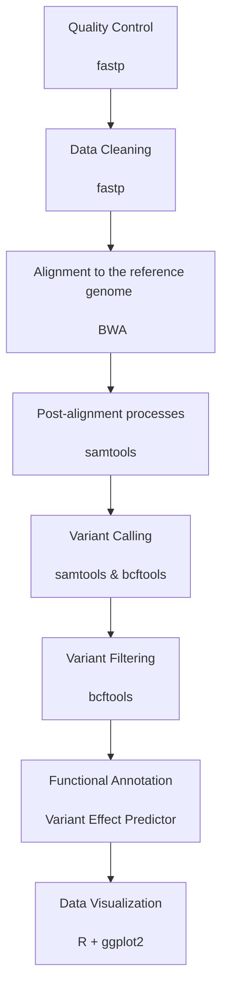

```mermaid
flowchart TD;
    A[Quality Control \n\n fastp] --> B[Data Cleaning \n\n fastp];
    
    B[Data Cleaning \n\n fastp] --> C[Alignment to the reference genome \n\n BWA];
    
    C[Alignment to the reference genome \n\n BWA] --> D[Post-alignment processes \n\n samtools];
    
    D[Post-alignment processes \n\n samtools] --> E[Variant Calling \n\n samtools & bcftools];
    
    E[Variant Calling \n\n samtools & bcftools] --> F[Variant Filtering \n\n bcftools];
    
    F[Variant Filtering \n\n bcftools] --> G[Functional Annotation \n\n Variant Effect Predictor];
    
    G[Functional Annotation \n\n Variant Effect Predictor] --> H[Data Visualization \n\n R + ggplot2];
```
