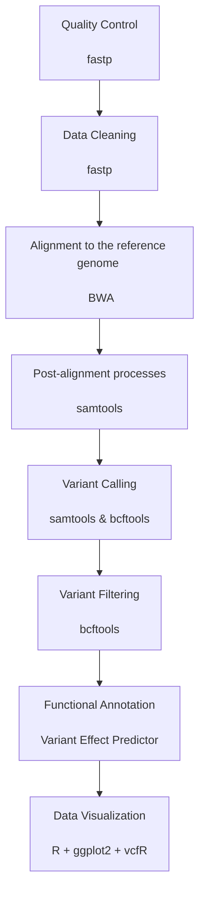

# Variant Calling pipeline for NGS Data Analysis Course

1. Obtaining project data from NCBI SRA database: SRA - SRP003355. The study was entitled "Pooled linkage analysis for discovery of Saccharomyces cerevisiae functional mutations by whole genome sequencing" and contained three samples:
    - Yeast vac22, wild-type segregant pool
    - Yeast vac6, mutant segregant pool
    - Yeast vac6, wild-type segregant pool

All samples were equenced via Illumina Genome Analyzer in WGS strategy using paired-end sequencing module.

2. The raw reads were controlled for its quality, and based on QC reports they were trimmed. Both steps were done by fastp software.

3. Cleaned reads were mapped to the reference genome, which was obtained via Ensembl Reference Genome Database. Alignment procedures were performed by BWA algorithm using BWA software with ALN option. 

4. Post alignment processes (SAM-BAM conversion, sorting, indexing, stats generating, and coverage calculating) were done by samtools software.

5. With use of samtools and bcftools variants were called by comparing aligned reads with reference genome.

6. Functional annotation was done by Variant Effect Predictor tool (VEP), provided by Ensembl.

7. VCF files along with annotated variants were visualized using R with ggplot2 and vcfR package

## General workflow

